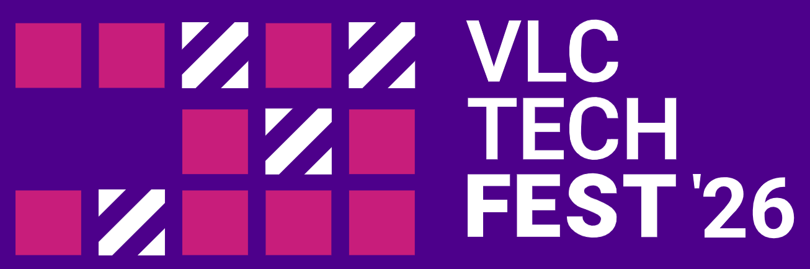

<!-- jump_to_middle -->

Don't Panic
===

<!-- font_size: 1 -->
<!-- alignment: center -->
It's just a local conference

<!-- end_slide -->

# What the heck is VLCTechFest?

From the [VLCTechFest website](https://vlctechfest.org): 

"The VLCTechFest is a day of talks by and for the technology communities of the Valencian Community".

<!-- pause -->

It is organized by anonymous individuals who change every year. The event is supported by VLCTechHub, a nonprofit organization dedicated to supporting technology communities in the Valencian Community. 

<!-- pause -->

It is different because:

- It is completely free. Free as in freedom and free as in beer. No registration needed.
- It brings together people from different tech communities the same day in the same venue.
- It has sponsors but it is not associated with a particular company.

# Cool, but show me something I can actually see. 

<!-- speaker_note: photos and video -->

# Nice! I want to go!

# AWESOME! I want to give a talk!

